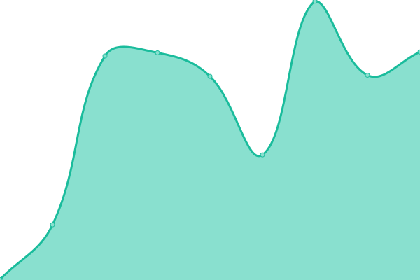

# [📈 Live Status](https://demo.upptime.js.org): <!--live status--> **🟧 Partial outage**

This repository contains the open-source uptime monitor and status page for [Himalaya Saxena](https://demo.upptime.js.org), powered by [Upptime](https://github.com/upptime/upptime).

With [Upptime](https://upptime.js.org), you can get your own unlimited and free uptime monitor and status page, powered entirely by a GitHub repository. We use [Issues](https://github.com/himalayadevo/medusa_monitoring/issues) as incident reports, [Actions](https://github.com/himalayadevo/medusa_monitoring/actions) as uptime monitors, and [Pages](https://demo.upptime.js.org) for the status page.

<!--start: status pages-->
<!-- This summary is generated by Upptime (https://github.com/upptime/upptime) -->
<!-- Do not edit this manually, your changes will be overwritten -->
<!-- prettier-ignore -->
| URL | Status | History | Response Time | Uptime |
| --- | ------ | ------- | ------------- | ------ |
|  [Medusadistribution](https://medusadistribution.com/) | 🟩 Up | [medusadistribution.yml](https://github.com/himalayadevo/medusa_monitoring/commits/HEAD/history/medusadistribution.yml) | 

 170ms
     
 | 

<a href="https://himalayadevo.github.io/medusa_monitoring/history/medusadistribution">100.00%</a>
    

|  [Frontend](https://beta.medusadistribution.com/) | 🟩 Up | [frontend.yml](https://github.com/himalayadevo/medusa_monitoring/commits/HEAD/history/frontend.yml) | 

 191ms
     
 | 

<a href="https://himalayadevo.github.io/medusa_monitoring/history/frontend">100.00%</a>
    

|  [Admin](https://admin.medusadistribution.com/) | 🟩 Up | [admin.yml](https://github.com/himalayadevo/medusa_monitoring/commits/HEAD/history/admin.yml) | 

 337ms
     
 | 

<a href="https://himalayadevo.github.io/medusa_monitoring/history/admin">99.79%</a>
    

|  [Purchase Order Lines](https://api.tradegecko.com/purchase_order_line_items?limit=250&page=next) | 🟥 Down | [purchase-order-lines.yml](https://github.com/himalayadevo/medusa_monitoring/commits/HEAD/history/purchase-order-lines.yml) | 

 931ms
     
 | 

<a href="https://himalayadevo.github.io/medusa_monitoring/history/purchase-order-lines">92.36%</a>
    

|  [Stock adjustments API](https://api.tradegecko.com/stock_adjustments/6114387) | 🟥 Down | [stock-adjustments-api.yml](https://github.com/himalayadevo/medusa_monitoring/commits/HEAD/history/stock-adjustments-api.yml) | 

 113ms
     
 | 

<a href="https://himalayadevo.github.io/medusa_monitoring/history/stock-adjustments-api">92.52%</a>
    

|  [Purchase Orders API](https://api.tradegecko.com/purchase_orders/1711730) | 🟥 Down | [purchase-orders-api.yml](https://github.com/himalayadevo/medusa_monitoring/commits/HEAD/history/purchase-orders-api.yml) | 

 123ms
     
 | 

<a href="https://himalayadevo.github.io/medusa_monitoring/history/purchase-orders-api">92.52%</a>
    

|  [Variants API](https://api.tradegecko.com/variants/70061913) | 🟥 Down | [variants-api.yml](https://github.com/himalayadevo/medusa_monitoring/commits/HEAD/history/variants-api.yml) | 

 111ms
     
 | 

<a href="https://himalayadevo.github.io/medusa_monitoring/history/variants-api">92.52%</a>
    

|  [TG orders API](https://api.tradegecko.com/orders/91163271) | 🟥 Down | [tg-orders-api.yml](https://github.com/himalayadevo/medusa_monitoring/commits/HEAD/history/tg-orders-api.yml) | 

 118ms
     
 | 

<a href="https://himalayadevo.github.io/medusa_monitoring/history/tg-orders-api">92.52%</a>
    

|  [Products API](https://api.tradegecko.com/products/39126162) | 🟥 Down | [products-api.yml](https://github.com/himalayadevo/medusa_monitoring/commits/HEAD/history/products-api.yml) | 

 116ms
     
 | 

<a href="https://himalayadevo.github.io/medusa_monitoring/history/products-api">92.51%</a>
    

|  [Purchase Orders (All Statuses) API](https://api.tradegecko.com/purchase_orders?limit=250&page=next) | 🟥 Down | [purchase-orders-all-statuses-api.yml](https://github.com/himalayadevo/medusa_monitoring/commits/HEAD/history/purchase-orders-all-statuses-api.yml) | 

 1160ms
     
 | 

<a href="https://himalayadevo.github.io/medusa_monitoring/history/purchase-orders-all-statuses-api">92.51%</a>
    

|  [All Variants (archived & active) API](https://api.tradegecko.com/variants?limit=250&status=archived,active) | 🟥 Down | [all-variants-archived-and-active-api.yml](https://github.com/himalayadevo/medusa_monitoring/commits/HEAD/history/all-variants-archived-and-active-api.yml) | 

 1037ms
     
 | 

<a href="https://himalayadevo.github.io/medusa_monitoring/history/all-variants-archived-and-active-api">92.51%</a>
    

|  [All Products (archived & active) API](https://api.tradegecko.com/products?limit=250&status=archived,active) | 🟥 Down | [all-products-archived-and-active-api.yml](https://github.com/himalayadevo/medusa_monitoring/commits/HEAD/history/all-products-archived-and-active-api.yml) | 

 470ms
     
 | 

<a href="https://himalayadevo.github.io/medusa_monitoring/history/all-products-archived-and-active-api">92.51%</a>
    

|  [Companies API](https://api.tradegecko.com/companies/62791314) | 🟥 Down | [companies-api.yml](https://github.com/himalayadevo/medusa_monitoring/commits/HEAD/history/companies-api.yml) | 

 109ms
     
 | 

<a href="https://himalayadevo.github.io/medusa_monitoring/history/companies-api">92.51%</a>
    

|  [Sales Orders (All Statuses) API](https://api.tradegecko.com/orders?limit=250&status=archived,active) | 🟥 Down | [sales-orders-all-statuses-api.yml](https://github.com/himalayadevo/medusa_monitoring/commits/HEAD/history/sales-orders-all-statuses-api.yml) | 

 110ms
     
 | 

<a href="https://himalayadevo.github.io/medusa_monitoring/history/sales-orders-all-statuses-api">92.50%</a>
    

|  [Purchase Order Line Items API](https://api.tradegecko.com/purchase_order_line_items?limit=250&page=next) | 🟥 Down | [purchase-order-line-items-api.yml](https://github.com/himalayadevo/medusa_monitoring/commits/HEAD/history/purchase-order-line-items-api.yml) | 

 491ms
     
 | 

<a href="https://himalayadevo.github.io/medusa_monitoring/history/purchase-order-line-items-api">92.50%</a>
    

|  [Get Suppliers](https://api.tradegecko.com/companies?company_type=supplier) | 🟥 Down | [get-suppliers.yml](https://github.com/himalayadevo/medusa_monitoring/commits/HEAD/history/get-suppliers.yml) | 

 135ms
     
 | 

<a href="https://himalayadevo.github.io/medusa_monitoring/history/get-suppliers">92.50%</a>
    

|  [TAX API](https://api.tradegecko.com/products/35401427) | 🟥 Down | [tax-api.yml](https://github.com/himalayadevo/medusa_monitoring/commits/HEAD/history/tax-api.yml) | 

 117ms
     
 | 

<a href="https://himalayadevo.github.io/medusa_monitoring/history/tax-api">92.50%</a>
    

<!--end: status pages-->

[**Visit our status website →**](https://demo.upptime.js.org)

## 📄 License

- Powered by: [Upptime](https://github.com/upptime/upptime)
- Code: [MIT](./LICENSE) © [Himalaya Saxena](https://demo.upptime.js.org)
- Data in the `./history` directory: [Open Database License](https://opendatacommons.org/licenses/odbl/1-0/)
